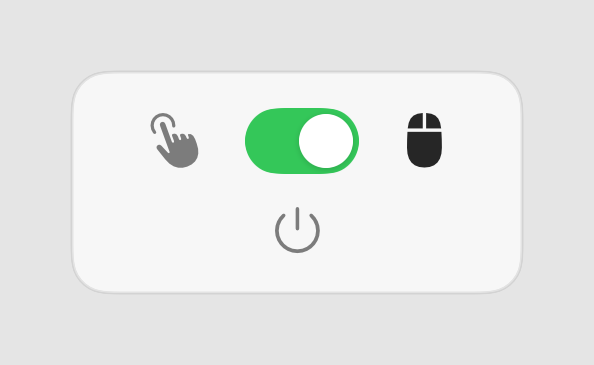

# Scroll Fixer

Read this in other languages: [Türkçe](README.tr.md)

A tiny macOS menu bar app that fixes mouse scroll direction.

If you use a **trackpad and a mouse at the same time**, macOS forces both to share one scroll direction. Turn on "natural scrolling" and your trackpad feels right but your mouse feels backwards. Turn it off and it is the other way around.

Scroll Fixer solves this. It lets you flip **only the mouse** scroll direction with a single switch in the menu bar, without ever touching your system's natural scrolling setting. The trackpad keeps working exactly as before.

<p align="center">
  
</p>

## Features

- One switch in the menu bar. Toggle it on when you are on the mouse, off when you are on the trackpad.
- Only affects the mouse scroll wheel. Trackpad gestures are never modified.
- Does not change any system setting. Your macOS "natural scrolling" preference stays untouched.
- Remembers your choice between restarts.
- Launches automatically at login and stays in the menu bar.
- Lightweight and native. Written in Swift/SwiftUI, no background services or telemetry.

## Requirements

- macOS 26 (Tahoe) or later
- Apple Silicon or Intel Mac

## Install

1. Download the latest `Scroll Fixer.dmg` from the [Releases](../../releases) page.
2. Open the DMG and **drag Scroll Fixer into the Applications folder** shown in the window.
3. Open **Scroll Fixer** from your Applications folder (double-click). The app is signed with a Developer ID and notarized by Apple, so it opens without any security warnings.
4. On first launch, macOS will ask for **Accessibility** permission. This is required so the app can read and flip scroll events.
   - Open **System Settings > Privacy & Security > Accessibility**.
   - Enable **Scroll Fixer**.
   - If the switch does not take effect immediately, quit and reopen the app.

> **Important:** Always move the app into the **Applications** folder before opening it. If you run it directly from the DMG or the download folder, macOS isolates it (App Translocation) and the Accessibility permission will not stick, so scrolling will not be flipped.

A plain `Scroll Fixer.zip` is also attached to each release if you prefer. If you use it, unzip it and move **Scroll Fixer.app** into Applications before opening, for the same reason as above.

## Usage

- Look for the mouse / hand icon in your menu bar.
- Click it to open the switch.
- **Switch on** = you are using the mouse, scroll direction is flipped.
- **Switch off** = you are using the trackpad, nothing is changed.
- The small power button quits the app.

That is the whole app. Set it and forget it.

## Why it needs Accessibility permission

To change how the mouse scrolls, the app installs a low-level event tap that watches scroll wheel events and inverts them while the switch is on. macOS requires Accessibility permission for any app that reads system input events. Scroll Fixer only ever touches scroll wheel events, and only while the switch is on. It sends nothing off your Mac.

## Build from source

You need Xcode installed.

```bash
git clone https://github.com/MehmetAkifff/scroll-fixer.git
cd scroll-fixer
xcodebuild -project mouseSwitcher.xcodeproj -scheme mouseSwitcher -configuration Release build
```

Or just open `mouseSwitcher.xcodeproj` in Xcode and press Run.

The built `Scroll Fixer.app` will be inside Xcode's DerivedData `Build/Products/Release` folder. Copy it into `/Applications` to install.

## How it works

The core is in [`ScrollManager.swift`](mouseSwitcher/ScrollManager.swift). It creates a `CGEvent` tap for scroll wheel events. When the switch is on, it reads all delta fields of each incoming scroll event and writes back their negatives, so scrolling one way becomes the other. When the switch is off, events pass through untouched. The system's global natural scrolling setting is never read or modified.

## License

MIT. See [LICENSE](LICENSE).
